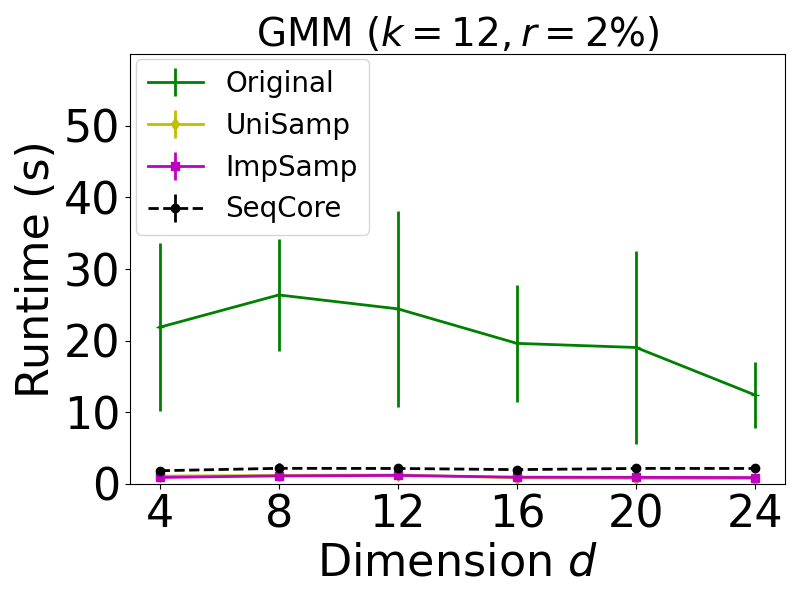
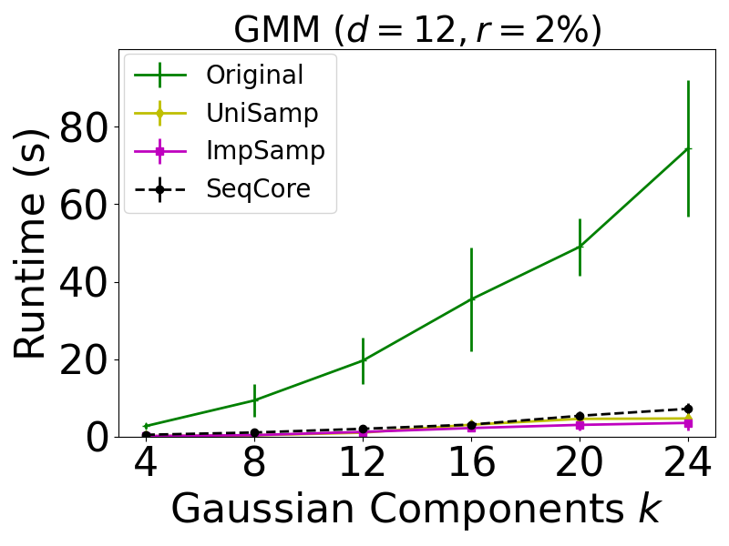
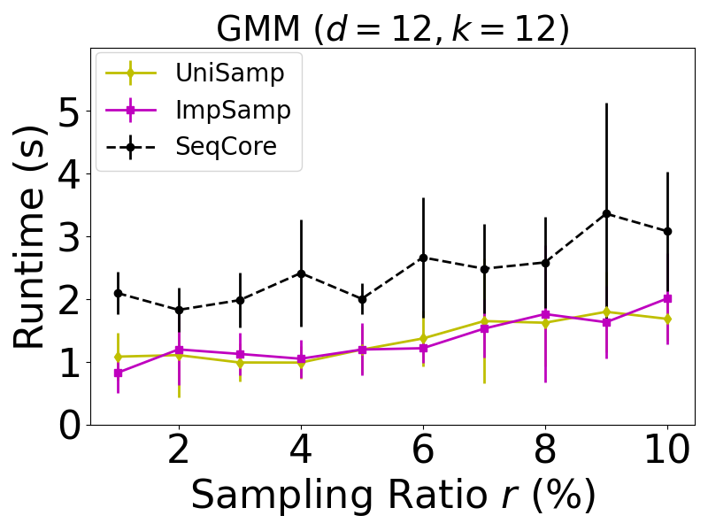
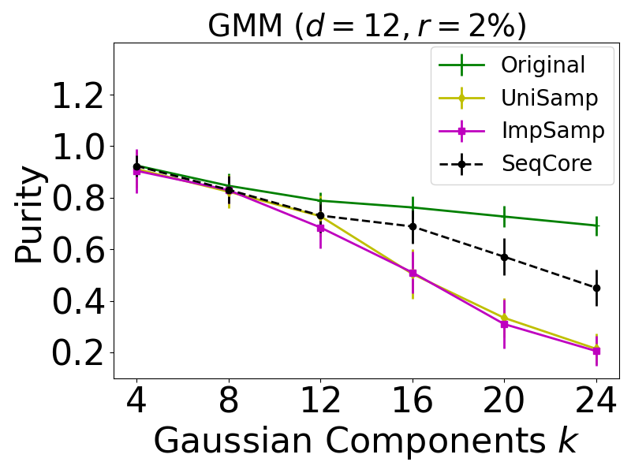
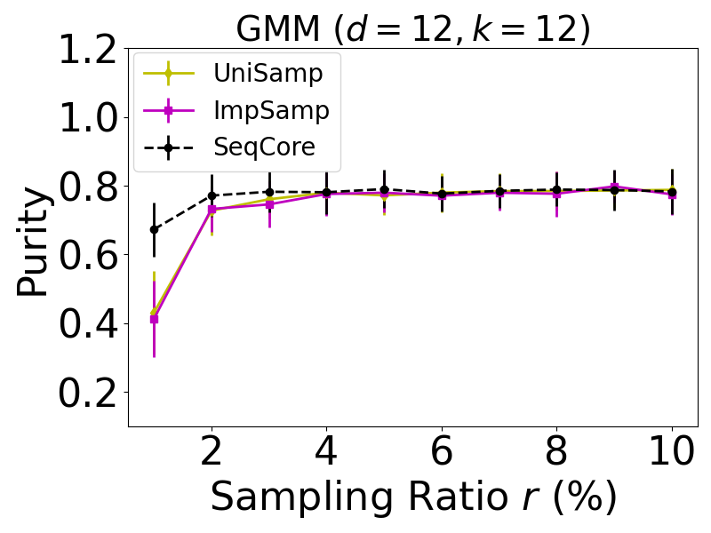

# Sequential Coreset for Gaussian Mixture Models

Sequential coreset is a data-driven compression technique that accelerates many algorithms based on their locality property.

Here is an implementation of the GMM model with a sequential coreset based on the <a href="https://github.com/zalanborsos/coresets" target="_blank">weighted GMM</a> and <a href="https://github.com/scikit-learn/scikit-learn/tree/7e1e6d09bcc2eaeba98f7e737aac2ac782f0e5f1/sklearn/mixture" target="_blank">sklearn.mixture</a>. 

The code in the *tests* folder replicates the GMM parts of the experiments from our paper <a href="https://arxiv.org/abs/2112.02504" target="_blank">A Novel Sequential Coreset Method for Gradient Descent Algorithms</a>. 


## 1 Installation

Similar to the <a href="https://github.com/zalanborsos/coresets" target="_blank">weighted GMM</a> except for versions of some packages. 

### 1.1 Dependencies

```
pybind11>=2.2
scikit-learn>=1.0.2
numpy>=1.13.3
scipy>=1.1.0
pytest
matplotlib
```

### 1.2 Setup

```
pip install -r requirements.txt
python setup.py build_ext --inplace
```


## 2 Experimental Results

### 2.1 Running tests

#### Platform:

Ubuntu: 20.04

#### Files & Folders

```
│ ...
│ 
├─tests
│  │  coreset_test_d.py
│  │  coreset_test_k.py
│  │  coreset_test_size.py
│  │
│  ├─log
│  │
│  └─result
│ ...
```


#### Algorithms for testing

Uniform Sampling, Importance Sampling for 

#### Datasets

Synthetic datasets generated by [`sklearn.datasets`](https://scikit-learn.org/stable/modules/classes.html#module-sklearn.datasets).make_classification (we set flip_y = 0.01 as default; set n_redundant  = n_repeated = n_features/4 when the dimension d >= 8). 

#### Some details

We removed the function Solution_inRange(self, prev\_weights\_, prev\_means\_, R) and construct sequential coreset when iteration # == 2^k, k = 0,1,...

We set init_params = 'kmeans'. We input the full data to sequential coreset method since we need construct the coreset dynamically. Sometimes it might lead to unfairness since the initialization process can access the whole data while other coreset algorithms can only access the coresets. So we adopt the function *_initialize_parameters_seq(self, X, random_state)* to conduct initialization for our sequential coreset algorithm. Function *_initialize_parameters_seq* do initialization on a uniform sample whose size is the *coreset_size*.  

### 2.2 Results


<center class="half">
    
  	
  	
</center>


<center class="half">



</center>


-------------
